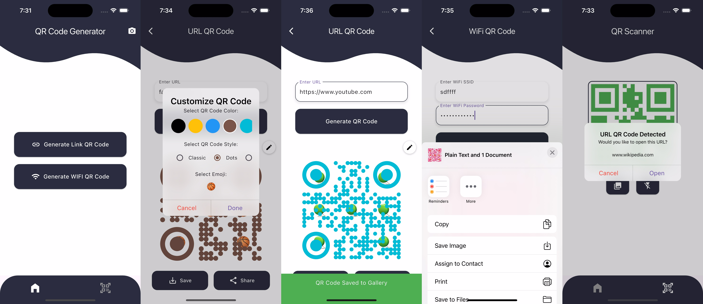

# QR Code Generator

A Flutter application that generates QR codes for URLs and WiFi credentials.

## Features

- Generate QR Codes
    Generate QR codes for URLs.
    Generate QR codes for WiFi credentials (SSID and password).

- QR Code Customization
    Customize QR codes with different colors, styles, and emojis.

- Save and Share
    Save the generated QR codes to your device's gallery.
    Share the QR codes through various apps.

- QR Code Scanning
    Scan QR codes using the device's camera with the option to use the flash.
    Open URLs directly in the browser when scanned.
    Connect to WiFi networks by scanning WiFi QR codes.

- Import QR Codes
    Import QR codes from the gallery for scanning.

## Screenshots

## Getting Started

1. Ensure you have Flutter installed on your machine.
2. Clone this repository.
3. Run `flutter pub get` to install dependencies.
4. Run the app using `flutter run`.

## Dependencies

- cupertino_icons: ^1.0.8 - Cupertino-style icons for iOS.
- emojis: ^0.9.9 - A package for adding emojis to QR codes.
- google_mlkit_barcode_scanning: ^0.12.0 - Barcode scanning using Google ML Kit.
- image_gallery_saver: ^2.0.3 - Save images to the gallery.
- image_picker: ^1.1.2 - Pick images from the gallery or camera.
- mobile_scanner: ^5.1.1 - A high-performance QR code and barcode scanner.
- path_provider: ^2.1.4 - Access to commonly used locations on the device file system.
- provider: ^6.1.2 - A state management solution.
- qr_code_scanner: ^1.0.1 - QR code scanner widget.
- qr_flutter: ^4.1.0 - Generate QR codes in Flutter.
- share_plus: ^7.2.1 - Share content with other apps.
- shared_preferences: ^2.3.2 - Store data locally on the device.
- url_launcher: ^6.3.0 - Launch URLs in the browser or other apps.
- wifi_iot: ^0.3.19 - Manage WiFi networks on iOS and Android.
- wifi_qr_flutter: ^1.0.1 - Generate WiFi QR codes.

## Usage

1. Launch the app and choose between generating a URL QR code or a WiFi QR code.
2. Enter the required information (URL or WiFi credentials).
3. Tap the "Generate QR Code" button to create the QR code.
4. The generated QR code will be displayed on the screen.
5. Customize the QR code with colors, styles, or emojis if desired.
6. Tap the "Generate QR Code" button to create the QR code.
7. Save the generated QR code to your gallery or share it through other apps.
8. Scan QR codes using the camera or import from the gallery. Scanned URLs will open in the browser, and WiFi QR codes will prompt to connect to the network.

## License

This project is licensed under the MIT License. See the [License](LICENSE) file for details.

## Contact

For any inquiries or feedback, please contact [@dcaayushd](https://x.com/dcaayushd).
